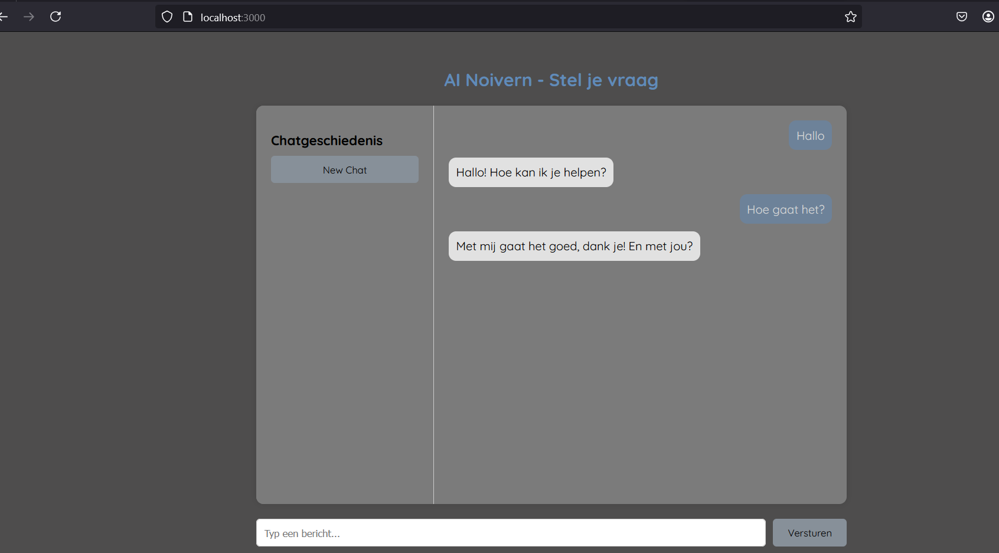

# Noivern

Noivern is een chatbot gebouwd met React en JavaScript. De chatbot kan gesprekken voeren, vragen beantwoorden en leren van gebruikers.

## Hoe werkt het?
1. Typ een bericht in het invoerveld.
2. Als de chatbot iets niet begrijpt, vraagt hij om uitleg begin met "het betekent ..." om hem iets nieuws te leren.
3. De chatbot onthoudt de nieuwe informatie en gebruikt deze in toekomstige gesprekken.

## Toekomstige functies
Dit zijn een paar ideeën die ik van plan ben toe te voegen.
1. Meer botdata
2. Machine learning
3. Meerdere talen
4. Backend met database
